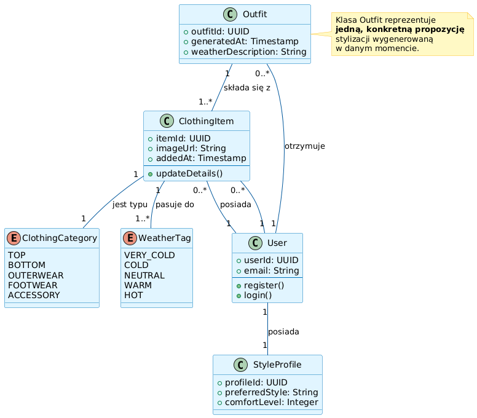

# Specyfikacja Wymagań Oprogramowania (SRS) dla Aplikacji "WearWise"

---

## 1. Wstęp

### 1.1. Cel
Niniejszy dokument stanowi Specyfikację Wymagań Oprogramowania (SRS) dla aplikacji mobilnej **WearWise**. Jest on przeznaczony dla zespołu deweloperskiego, projektantów UX/UI, testerów oraz interesariuszy projektu. Jego celem jest precyzyjne zdefiniowanie funkcjonalności, cech oraz ograniczeń systemu, stanowiąc podstawę do dalszych prac projektowych, implementacyjnych i testowych.

### 1.2. Wizja, Zakres i Cele Produktu
*   **Wizja:** Być inteligentnym, osobistym stylistą w kieszeni każdego, kto chce ubierać się odpowiednio do pogody i własnego stylu, bez codziennego zastanawiania się "w co się ubrać?".
*   **Zakres:** Aplikacja WearWise pozwala na stworzenie cyfrowego inwentarza Twojej szafy. Użytkownik dodaje zdjęcia swoich ubrań i opisuje je kilkoma atrybutami. Następnie, nasz inteligentny algorytm, bazując na aktualnej prognozie pogody dla Twojej lokalizacji oraz Twoich indywidualnych preferencjach, każdego ranka serwuje gotową propozycję stylizacji.
*   **Poza Zakresem:** Wersja 1.0 aplikacji nie będzie zawierać funkcji społecznościowych (udostępnianie stylizacji, komentowanie), e-commerce (zakup ubrań), ani zaawansowanego zarządzania szafą (np. planowanie prania).

### 1.3. Definicje, Akronimy i Skróty
*   **SRS:** Software Requirements Specification (Specyfikacja Wymagań Oprogramowania).
*   **API:** Application Programming Interface (Interfejs Programowania Aplikacji).
*   **Outfit:** Zestaw ubrań (np. koszula, spodnie, buty) proponowany przez aplikację.
*   **Supabase:** Otwartoźródłowa alternatywa dla Firebase używana jako backend (BaaS - Backend as a Service).
*   **React Native:** Framework do tworzenia aplikacji mobilnych na platformy iOS i Android.

### 1.4. Przegląd Dokumentu
Dokument ten jest podzielony na kluczowe sekcje. Rozdział 1 stanowi wprowadzenie. Rozdział 2 opisuje ogólne cechy produktu, jego użytkowników i ograniczenia. Rozdział 3 szczegółowo definiuje wymagania funkcjonalne. Rozdział 4 skupia się na atrybutach jakościowych. Rozdział 5 zawiera analizę porównawczą.

---

## 2. Opis Ogólny

### 2.1. Główne Funkcje Produktu
*   **Zarządzanie Wirtualną Szafą:** Dodawanie, kategoryzowanie i przeglądanie ubrań.
*   **Ankieta Stylu Użytkownika:** Zbieranie preferencji dotyczących stylu i komfortu.
*   **Generowanie Codziennego Outfitu:** Proponowanie zestawu ubrań na podstawie pogody i preferencji.
*   **Uwierzytelnianie Użytkownika:** Rejestracja i logowanie.

### 2.2. Klasy Użytkowników i Aktorzy Systemu

Na podstawie analizy interakcji z systemem (przedstawionej w diagramie przypadków użycia) identyfikujemy następujących aktorów:

*   **Aktor Główny (Użytkownik Końcowy):**
    *   **Opis:** Jest to główna i jedyna klasa użytkownika ludzkiego w systemie. Reprezentuje osobę, która instaluje aplikację w celu rozwiązania swojego codziennego problemu z doborem stroju.
    *   **Interakcje z systemem:**
        *   **Zarządza swoim kontem:** Rejestruje się, loguje i definiuje swoje preferencje w ankiecie stylu.
        *   **Zarządza Wirtualną Szafą:** Buduje cyfrową garderobę poprzez dodawanie, przeglądanie i usuwanie swoich ubrań.
        *   **Konsumuje główną wartość:** Otrzymuje i przegląda codzienne, automatycznie generowane propozycje outfitów.

*   **Aktor Drugorzędny (System Zewnętrzny):**
    *   **Nazwa:** **API Pogodowe**
    *   **Opis:** Jest to zewnętrzna usługa (system maszynowy), która dostarcza kluczowych danych niezbędnych do działania aplikacji. Nie jest to użytkownik ludzki, ale pełni rolę aktora, ponieważ system wchodzi z nim w interakcję w celu realizacji jednego z przypadków użycia.
    *   **Interakcje z systemem:**
        *   Dostarcza aktualne dane meteorologiczne (temperatura, warunki, np. deszcz, słońce) dla określonej lokalizacji geograficznej na żądanie systemu WearWise.


### 2.3. Ograniczenia projektowe

> **[DODANE]** 
* **Ograniczenie Zasobów Czasowych Zespołu:**
    * **Źródło:** Projekt realizowany w ramach jednego semestru akademickiego.
    * **Wpływ na architekturę:** Konieczność ograniczenia zakresu funkcjonalnego do MVP oraz unikania rozwiązań wymagających długiego czasu implementacji (np. własnych algorytmów ML, zaawansowanej personalizacji). Architektura musi umożliwiać szybkie dostarczanie działających funkcji w krótkich iteracjach.

* **Ograniczenie Kompetencji Technicznych Zespołu:**
    * **Źródło:** Zespół składa się z studentów o zróżnicowanym poziomie doświadczenia w technologiach mobilnych i backendowych.
    * **Wpływ na architekturę:** Preferowane są rozwiązania o niskim progu wejścia, dobrze udokumentowane i z szerokim wsparciem społeczności. Wyklucza to implementację skomplikowanych wzorców architektonicznych oraz niestandardowych rozwiązań infrastrukturalnych.

* **Ograniczenie Budżetowe:**
    * **Źródło:** Projekt nie posiada dedykowanego budżetu finansowego.
    * **Wpływ na architekturę:** Wymusza wykorzystanie wyłącznie darmowych planów narzędzi i usług (Supabase Free Tier, darmowe API pogodowe). Ogranicza skalę przechowywanych danych, liczbę zapytań do API oraz uniemożliwia korzystanie z płatnych usług chmurowych.

* **Ograniczenie Infrastrukturalne:**
    * **Źródło:** Brak możliwości utrzymywania własnych serwerów produkcyjnych przez zespół studencki.
    * **Wpływ na architekturę:** Backend musi być w pełni oparty na rozwiązaniu typu BaaS (Backend as a Service). Wyklucza to architekturę opartą o samodzielnie zarządzane serwery, kontenery Docker czy zaawansowaną orkiestrację (np. Kubernetes).

* **Ograniczenie Testowe i Operacyjne:**
    * **Źródło:** Ograniczony dostęp do rzeczywistych użytkowników końcowych oraz środowisk produkcyjnych.
    * **Wpływ na architekturę:** System musi być projektowany w sposób umożliwiający łatwe testowanie lokalne oraz ręczne testy akceptacyjne. Ogranicza to możliwość przeprowadzania testów obciążeniowych na dużą skalę oraz wymusza prostotę konfiguracji środowisk.


### 2.4. Założenia projektowe
*   **Założenie Techniczne:**
    *   **Założenie:** Zakładamy, że darmowy plan wybranego API pogodowego (np. OpenWeatherMap) zapewni wystarczającą dokładność danych i limit zapytań dla początkowej fazy działania aplikacji (MVP).
    *   **Ryzyko:** Jeśli API będzie niedokładne, będzie miało zbyt niski limit zapytań lub zostanie wyłączone, główna funkcja generowania outfitów przestanie działać poprawnie, co zrujnuje doświadczenie użytkownika.
    *   **Plan walidacji:** W pierwszym tygodniu projektu deweloper przeprowadzi testy integracyjne z 2-3 dostawcami API pogodowego, aby zweryfikować dokładność danych dla kilku lokalizacji oraz sprawdzić realne limity i opóźnienia w odpowiedziach.

*   **Założenie Dotyczące Użytkownika:**
    *   **Założenie:** Zakładamy, że użytkownicy będą gotowi poświęcić czas na sfotografowanie i skatalogowanie co najmniej 15-20 sztuk swoich ubrań, aby system mógł generować sensowne propozycje.
    *   **Ryzyko:** Jeśli proces dodawania ubrań będzie zbyt uciążliwy, użytkownicy porzucą aplikację, zanim system zgromadzi wystarczająco danych, by być użytecznym. Aplikacja zostanie uznana za bezwartościową.
    *   **Plan walidacji:** Przed implementacją docelowej funkcjonalności, projektant UX stworzy klikalny prototyp (w Figmie) procesu dodawania ubrania i przeprowadzi testy użyteczności z 5 potencjalnymi użytkownikami, mierząc czas i subiektywną ocenę łatwości tego procesu.


## 3. Wymagania Funkcjonalne

> **[DODANE]** 

### 3.1. Uwierzytelnianie i Zarządzanie Kontem

#### 3.1.1. Rejestracja użytkownika

* **WF-AUTH-01:** System musi umożliwiać rejestrację użytkownika przy użyciu adresu e-mail i hasła.
* **WF-AUTH-02:** Hasło musi mieć **minimum 8 znaków**, w tym co najmniej 1 cyfrę.
* **WF-AUTH-03:** Po pomyślnej rejestracji użytkownik musi zostać automatycznie zalogowany.
* **WF-AUTH-04:** System musi uniemożliwić rejestrację konta z adresem e-mail już istniejącym w bazie.

#### 3.1.2. Logowanie

* **WF-AUTH-05:** System musi umożliwiać logowanie w czasie **< 1 sekundy** przy poprawnych danych.
* **WF-AUTH-06:** Po 5 nieudanych próbach logowania konto zostaje czasowo zablokowane (5 minut).

---

### 3.2. Zarządzanie Wirtualną Szafą (ROZSZERZONE)

#### 3.2.1. Dodawanie ubrań

* **WF-SZAFA-02:** System musi umożliwiać dodanie **minimum 100 ubrań** na jednego użytkownika.
* **WF-SZAFA-03:** Każde ubranie musi posiadać obowiązkowe atrybuty:
  * kategoria,
  * zdjęcie,
  * poziom ciepła (1–10),
  * odporność na deszcz (0–10).
* **WF-SZAFA-04:** Czas dodania jednego ubrania (od otwarcia formularza do zapisu) nie może przekroczyć **30 sekund**.

#### 3.2.2. Przeglądanie i filtrowanie

* **WF-SZAFA-05:** System musi umożliwiać filtrowanie ubrań według co najmniej **4 kryteriów** (kategoria, ciepło, kolor, okazja).
* **WF-SZAFA-06:** Wyniki filtrowania muszą być wyświetlane w czasie **< 500 ms**.

#### 3.2.3. Edycja i usuwanie

* **WF-SZAFA-07:** Użytkownik musi mieć możliwość edycji wszystkich atrybutów ubrania.
* **WF-SZAFA-08:** Usunięcie ubrania musi być potwierdzone dialogiem (ochrona przed błędem).

---

### 3.3. Ankieta Preferencji Stylu **[DODANE]**

* **WF-STYL-01:** System musi przeprowadzić ankietę składającą się z **minimum 5 pytań**.
* **WF-STYL-02:** Każde pytanie musi mieć skalę odpowiedzi (np. 1–5).
* **WF-STYL-03:** Wyniki ankiety muszą być zapisane w profilu użytkownika i wykorzystywane przez algorytm rekomendacji.

---

### 3.4. Generowanie Codziennego Outfitu (ROZSZERZONE)

* **WF-OUTFIT-03:** System musi generować **dokładnie jeden outfit dziennie** w wersji MVP.
* **WF-OUTFIT-04:** Outfit musi składać się z **minimum 3 elementów** (góra, dół, buty).
* **WF-OUTFIT-05:** Żadne ubranie nie może pojawić się w outficie częściej niż **2 dni z rzędu**.
* **WF-OUTFIT-06:** Generowanie outfitu musi zakończyć się w czasie **< 2 sekund**.

---

### 3.5. Obsługa Sytuacji Wyjątkowych **[DODANE]**

* **WF-EX-01:** W przypadku braku połączenia z API pogodowym system musi użyć **ostatnio zapisanej prognozy**.
* **WF-EX-02:** W przypadku braku wystarczających danych system musi wyświetlić jasny komunikat z instrukcją dla użytkownika.

---

## 4. Atrybuty Jakościowe

### 4.1. Priorytetyzacja Atrybutów
1.  **Modyfikowalność:** Ważna w kontekście przyszłego rozwoju. Architektura musi pozwalać na łatwe dodawanie nowych funkcji (np. integracja z e-commerce, funkcje społecznościowe) bez przepisywania całości.
2.  **Dostępność:** Aplikacja musi być dostępna każdego ranka, gdy użytkownik się ubiera. Awaria w tym momencie podważa sens istnienia produktu.
3.  **Wydajność:** Kluczowa dla pozytywnego pierwszego wrażenia. Użytkownik oczekuje natychmiastowej propozycji ubioru po otwarciu aplikacji.
4.  **Bezpieczeństwo:** Standardowy wymóg, ale mniej krytyczny niż w aplikacjach finansowych. Obejmuje ochronę danych logowania i wizerunku (zdjęcia ubrań).

### 4.2. Mierzalna specyfikacja (dla TOP 3 atrybutów)

#### Scenariusz 1: Wydajność (Generowanie Outfitu)
| Element | Opis |
| :--- | :--- |
| **Źródło bodźca** | Użytkownik końcowy. |
| **Bodziec** | Otwarcie aplikacji na ekranie głównym. |
| **Artefakt** | Cały system (aplikacja mobilna, backend, API pogodowe). |
| **Środowisko** | Normalne działanie, użytkownik ma połączenie z internetem. |
| **Reakcja** | System pobiera pogodę, analizuje szafę użytkownika i wyświetla gotowy outfit. |
| **Miara reakcji** | Czas od otwarcia aplikacji do pełnego wyświetlenia propozycji outfitu jest **krótszy niż 2 sekundy dla 95% przypadków**. |

#### Scenariusz 2: Dostępność (Poranna Gotowość)
| Element | Opis |
| :--- | :--- |
| **Źródło bodźca** | Wewnętrzny system monitorujący. |
| **Bodziec** | Awaria pojedynczej instancji serwera aplikacyjnego lub bazy danych. |
| **Artefakt** | Infrastruktura backendowa na Supabase. |
| **Środowisko** | Godziny szczytu porannego (6:00 - 9:00 AM). |
| **Reakcja** | System powinien kontynuować działanie bez widocznej przerwy dla użytkownika. |
| **Miara reakcji** | Dostępność usługi generowania outfitów wynosi **99.5%** w skali miesiąca. |

#### Scenariusz 3: Modyfikowalność (Dodanie Nowego Atrybutu Ubrania)
| Element | Opis |
| :--- | :--- |
| **Źródło bodźca** | Deweloper. |
| **Bodziec** | Konieczność dodania nowego atrybutu do ubrań, np. "formalność" (codzienne, biznesowe). |
| **Artefakt** | Baza danych, backend (logika generowania outfitu), aplikacja mobilna (formularz dodawania). |
| **Środowisko** | Środowisko deweloperskie. |
| **Reakcja** | Deweloper modyfikuje schemat bazy, logikę i interfejs użytkownika. |
| **Miara reakcji** | Czas pracy potrzebny na zaimplementowanie i wdrożenie tej zmiany **nie przekracza 4 godzin roboczych**. |


### 4.3. Analiza Kompromisów Architektonicznych
*   **Cel (Wydajność):** Osiągnięcie czasu odpowiedzi < 2s.
*   **Możliwe rozwiązanie:** Pre-generowanie outfitów w nocy dla wszystkich użytkowników i przechowywanie ich w cache.
*   **Kompromis:**
    *   **Pozytywny:** Drastycznie poprawia **wydajność** odczuwalną przez użytkownika rano.
    *   **Negatywny:**
        *   Zwiększa **koszt operacyjny** (dodatkowe zasoby obliczeniowe w nocy).
        *   Pogarsza **elastyczność** - jeśli użytkownik doda nowe ubranie rano, nie zostanie ono uwzględnione w outficie na ten dzień, chyba że zaimplementuje się skomplikowaną logikę re-walidacji.


## 5. Odkrywanie i Analiza Wymagań

### 5.1. Analiza Porównawcza

**Krok 1: Identyfikacja Konkurencji/Wzorców**
*   **Konkurencja bezpośrednia:** Aplikacje takie jak Cladwell, Stylebook, Acloset.
*   **Konkurencja pośrednia:** Pinterest (inspiracje modowe), aplikacje pogodowe z "indeksem ubioru".
*   **Wzorce funkcjonalne:** Aplikacje do katalogowania (np. książek, filmów) pod kątem łatwości dodawania nowych pozycji.

**Krok 2: Tabela Porównawcza**
| Kryterium | Cladwell | Stylebook | Acloset | **WearWise (plan)** |
| :--- | :--- | :--- | :--- | :--- |
| **Model Biznesowy** | Subskrypcja | Płatność jednorazowa | Freemium (funkcje premium) | **Darmowa (MVP)** |
| **Automatyczne usuwanie tła** | Tak | Tak (narzędzia) | Tak (automatyczne) | **Nie (MVP)** |
| **Generowanie outfitów** | Tak, automatyczne | Tak, manualne i auto | Tak, automatyczne | **Tak, automatyczne** |
| **Aspekt społecznościowy** | Nie | Tak (udostępnianie) | Tak (mocno rozbudowany) | **Nie (MVP)** |
| **Integracja z pogodą** | Tak | Tak | Tak | **Tak (kluczowa funkcja)** |
| **Łatwość użycia (UX)** | Wysoka, minimalistyczny | Średnia, dużo funkcji | Wysoka, nowoczesny UI | **Priorytet: Maksymalna prostota** |

**Krok 3: Synteza Wyników i Wnioski**
*   **Co konkurencja robi dobrze?** Automatyzacja (usuwanie tła, generowanie stylizacji) jest standardem. Integracja z pogodą jest obecna, ale często jako jedna z wielu funkcji.
*   **Gdzie są ich słabe punkty?** Wiele aplikacji jest przeładowanych funkcjami (planowanie podróży, statystyki noszenia), co może przytłaczać nowego użytkownika. Modele subskrypcyjne lub płatne z góry stanowią barierę wejścia.
*   **Wpływ na WearWise:** Naszą szansą jest **skupienie się na jednej rzeczy i robienie jej doskonale**: codziennej, automatycznej propozycji outfitu opartej na pogodzie. Rezygnujemy z zaawansowanych funkcji zarządzania szafą i aspektów społecznościowych w MVP, aby zaoferować maksymalnie prosty i darmowy produkt, który rozwiązuje jeden, konkretny problem. To nasza główna przewaga konkurencyjna.

---

## Dodatki

### Dodatek A: Modele Analityczne

#### Diagram Przypadków Użycia



### Dodatek B: Persony Użytkowników

#### Persona 1: "Zajęty Profesjonalista"
*   **Imię:** Jakub
*   **Wiek:** 32 lata
*   **Zawód:** Programista
*   **Cele:** Chce dobrze wyglądać w pracy, ale nienawidzi tracić czasu na poranne decyzje dotyczące ubioru. Chce mieć pewność, że jego strój jest adekwatny do pogody, zwłaszcza gdy dojeżdża do biura rowerem.
*   **Frustracje:** Często ubiera się nieodpowiednio do pogody (za ciepło/za zimno). Jego szafa jest pełna ubrań, ale rano ma wrażenie, że "nie ma się w co ubrać".

#### Persona 2: "Świadoma Studentka"
*   **Imię:** Zofia
*   **Wiek:** 21 lat
*   **Zawód:** Studentka psychologii
*   **Cele:** Chce w pełni wykorzystywać ubrania, które już posiada, aby ograniczyć konsumpcjonizm. Lubi eksperymentować ze stylem, ale potrzebuje inspiracji, jak łączyć swoje ubrania w nowe zestawy.
*   **Frustracje:** Zapomina o ubraniach, które ma na dnie szafy. Wydaje pieniądze na nowe rzeczy, mimo że ma już podobne.

### Dodatek C: Kwestie do Rozwiązania
1.  Jaki będzie dokładny koszt korzystania z API pogodowego po przekroczeniu darmowego progu? (Do zbadania)
2.  Jak dokładnie zdefiniować "styl" użytkownika w ankiecie, aby był on zrozumiały i użyteczny dla algorytmu? (Wymaga prototypowania i testów UX)
3.  W jaki sposób aplikacja ma obsługiwać ubrania uniwersalne, np. jeansy, które pasują zarówno na chłodne, jak i cieplejsze dni? (Wymaga decyzji projektowej)
4.  Czy zdjęcia ubrań będą przechowywane prywatnie, czy Supabase domyślnie udostępnia je publicznie przez URL? (Kwestia bezpieczeństwa do weryfikacji)

## Dodatek D: Szczegółowa Logika Algorytmu Rekomendacji "WearWise"

### D.1. Wstęp
Niniejszy dodatek definiuje techniczną logikę działania silnika rekomendacji w aplikacji WearWise. Algorytm jest systemem deterministycznym, opartym na regułach (Rule-Based System) oraz funkcji kosztu (Cost Function), mającym na celu dobranie optymalnego zestawu ubrań poprzez minimalizację "punktów karnych" za niedopasowanie termiczne, pogodowe i stylistyczne.

### D.2. Model Danych Wejściowych
Algorytm przetwarza dwa strumienie danych:

1.  **Szafa Użytkownika (`CLOSET`)**: Lista obiektów, gdzie każdy przedmiot posiada atrybuty:
    * `id`: Unikalny identyfikator.
    * `type`: Kategoria (top, bottom, shoes).
    * `layer`: Warstwa (1 - baza, 2 - środek, 3 - wierzch) – dotyczy tylko kategorii 'top'.
    * `warmth`: Indeks ciepła (skala 1-10).
    * `rain_index`: Odporność na wodę (skala 0-10, gdzie 0 = przemakalne, 10 = wodoodporne).
    * `tags`: Zbiór tagów (np. `["casual", "gym", "elegant"]`).
    * `color`: Kolor dominujący (np. `"black"`, `"navy"`).

2.  **Kontekst (`UserRequest`)**:
    * `temperature`: Temperatura powietrza (°C).
    * `wind_speed`: Prędkość wiatru (km/h).
    * `weather_code`: Kod pogody WMO (definiuje opady).
    * `occasion`: Kontekst wyjścia (`"casual"`, `"work"`, `"date"`, `"gym"`).
    * `mood_score`: Preferencja stylu (1-5).

### D.3. Krok 1: Fizyka Pogody (Pre-processing)
System normalizuje surowe dane pogodowe do wartości odczuwalnych przez człowieka.

* **Obliczanie Temperatury Odczuwalnej ($T_{real}$):**
    Korekta uwzględniająca czynnik chłodzący wiatru (*Wind Chill*). Stosowana, gdy $T_{air} < 20^\circ C$.
    $$T_{real} = T_{air} - (Wiatr \times 0.6)$$
* **Normalizacja Opadów:**
    Kody WMO są mapowane na skalę intensywności deszczu (0-30). Wartość $>5$ aktywuje tryb deszczowy.

### D.4. Krok 2: Filtracja Krytyczna (Hard Constraints)
Zanim system przystąpi do doboru zestawu, eliminuje z puli dostępnych ubrań te, które naruszają krytyczne zasady bezpieczeństwa lub kontekstu.

1.  **Filtr Wodny:**
    * *Warunek:* Jeśli Intensywność Deszczu $> 5$.
    * *Akcja:* Odrzuć przedmioty z `rain_index < 5` (np. sandały, zamsz, jasne płótno).
2.  **Filtr Termiczny (Zima):**
    * *Warunek:* Jeśli $T_{real} < 10^\circ C$.
    * *Akcja:* Odrzuć przedmioty o `warmth < 3` (np. szorty, cienkie spodnie).
    * *Wyjątek:* T-shirty (`layer: 1`) są dozwolone jako bielizna termiczna/podkoszulek.
3.  **Filtr Termiczny (Upał):**
    * *Warunek:* Jeśli $T_{real} > 25^\circ C$.
    * *Akcja:* Odrzuć przedmioty o `warmth > 4` (np. kurtki zimowe, ocieplane buty).
4.  **Filtr Okazji (Context Filter):**
    * *Warunek:* Zdefiniowana okazja inna niż "casual".
    * *Akcja:*
        * Dla `occasion="date"`: Odrzuć tagi `sport`, `gym`.
        * Dla `occasion="gym"`: Wymagaj tagu `sport` lub `gym`.

### D.5. Krok 3: Strategia Warstw (Dynamic Layering)
Algorytm dynamicznie ustala szablon zestawu (sloty do wypełnienia) w zależności od $T_{real}$.

| Warunki Termiczne | Struktura Zestawu (Sloty) | Cel Ciepła (Target Warmth) |
| :--- | :--- | :--- |
| **Lato** ($T_{real} \ge 22^\circ C$) | `[Top L1] + [Bottom] + [Shoes]` | **4 - 5 pkt** |
| **Przejściowa** ($10^\circ C \le T_{real} < 22^\circ C$) | `[Top L1] + [Top L2] + [Bottom] + [Shoes]` | **10 - 15 pkt** |
| **Zima** ($T_{real} < 10^\circ C$) | `[Top L1] + [Top L2] + [Top L3] + [Bottom] + [Shoes]` | **25+ pkt** |

### D.6. Krok 4: Funkcja Kosztu i Selekcja (Scoring)
System generuje możliwe kombinacje ubrań pasujące do wyznaczonych slotów. Każda kombinacja jest oceniana funkcją karną. Wygrywa zestaw z wynikiem najbliższym `0`.

**Wzór Funkcji Kosztu:**
$$Score = (0.6 \cdot \Delta Warm) + (0.5 \cdot \Delta Rain) + (0.5 \cdot StylePenalty)$$

**Składniki:**
* **$\Delta Warm$**: Wartość bezwzględna różnicy między *Celem Ciepła* a sumą atrybutów `warmth` wszystkich elementów zestawu.
* **$\Delta Rain$**: Różnica między intensywnością deszczu a średnią wodoodpornością zestawu (karane tylko niedostateczne zabezpieczenie).
* **$StylePenalty$ (Fashion Police)**:
    * **+50 pkt** (Kara krytyczna): Za wykrycie "zakazanych par" kolorystycznych (np. Czerń + Brąz, Czerwień + Zieleń).
    * **-10 pkt** (Bonus): Za zestaw monochromatyczny (spójność kolorystyczna).

### D.7. Schemat Działania Algorytmu

```mermaid
graph TD
    %% Definicja stylów
    classDef process fill:#e1f5fe,stroke:#01579b,stroke-width:2px;
    classDef decision fill:#fff9c4,stroke:#fbc02d,stroke-width:2px;
    classDef terminator fill:#e8f5e9,stroke:#2e7d32,stroke-width:2px;

    Start((Start)) --> Input[Pobranie Danych:<br/>Pogoda + Szafa + Okazja]
    Input --> Physics[Obliczanie Fizyki:<br/>Wind Chill & Rain Intensity]
    Physics --> Filter{HARD CONSTRAINTS<br/>Filtrowanie Szafy}
    
    Filter -->|Odrzuć| Bin[Kosz:<br/>Przemakalne, Nieadekwatne termicznie,<br/>Zły styl na okazję]
    Filter -->|Akceptuj| Valid[Lista: Valid Closet]
    
    Valid --> Layers{Jaka Temperatura?}
    
    Layers -->|Zimno <10C| L3[Sloty: Baza + Środek + Kurtka]
    Layers -->|Średnio 10-22C| L2[Sloty: Baza + Środek]
    Layers -->|Ciepło >22C| L1[Sloty: Baza]
    
    L3 & L2 & L1 --> Combo[Generowanie Kombinacji<br/>Iloczyn Kartezjański]
    
    Combo --> Score{OCENA PUNKTOWA}
    Score --> Calc1[Kara za różnicę ciepła]
    Score --> Calc2[Kara za brak wodoodporności]
    Score --> Calc3[Kara za gryzące się kolory]
    
    Calc1 & Calc2 & Calc3 --> Sum[Suma Punktów Karnych]
    Sum --> Best[Wybierz zestaw z MIN Score]
    Best --> Output(((WYNIK:<br/>Lista ID Ubrań)))

    class Input,Physics,Valid,L1,L2,L3,Combo,Calc1,Calc2,Calc3,Sum,Best process;
    class Filter,Layers,Score decision;
    class Start,Output terminator;
