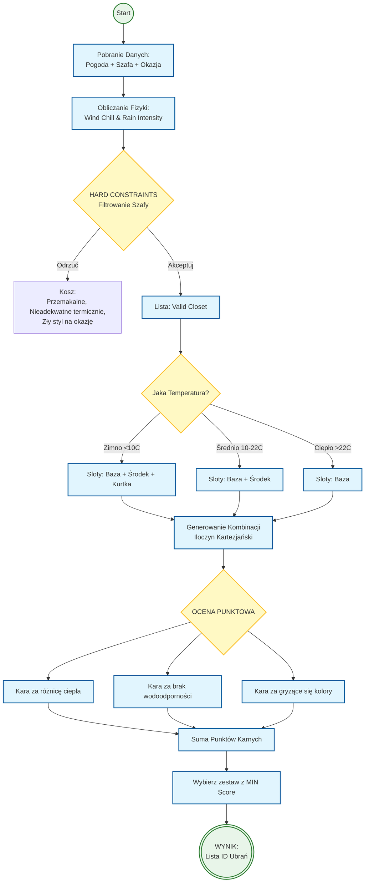

# Specyfikacja Wymagań Oprogramowania (SRS) dla Aplikacji "WearWise"

---

## 1. Wstęp

### 1.1. Cel ogólny
Niniejszy dokument stanowi Specyfikację Wymagań Oprogramowania (SRS) dla aplikacji mobilnej **WearWise**. Jest on przeznaczony dla zespołu deweloperskiego, projektantów UX/UI, testerów oraz interesariuszy projektu. Jego celem jest precyzyjne zdefiniowanie funkcjonalności, cech oraz ograniczeń systemu, stanowiąc podstawę do dalszych prac projektowych, implementacyjnych i testowych.

### 1.2. Wizja, Zakres i Cele Produktu
*   **Wizja:** Być inteligentnym, osobistym stylistą w kieszeni każdego, kto chce ubierać się odpowiednio do pogody i własnego stylu, bez codziennego zastanawiania się "w co się ubrać?".
*   **Zakres:** Aplikacja WearWise pozwala na stworzenie cyfrowego inwentarza Twojej szafy. Użytkownik dodaje zdjęcia swoich ubrań i opisuje je kilkoma atrybutami. Następnie, nasz inteligentny algorytm, bazując na aktualnej prognozie pogody dla Twojej lokalizacji oraz Twoich indywidualnych preferencjach, każdego ranka serwuje gotową propozycję stylizacji.
*   **Poza Zakresem:** Wersja 1.0 aplikacji nie będzie zawierać funkcji społecznościowych (udostępnianie stylizacji, komentowanie), e-commerce (zakup ubrań), ani zaawansowanego zarządzania szafą (np. planowanie prania).

### 1.3. Definicje, Akronimy i Skróty
*   **SRS:** Software Requirements Specification (Specyfikacja Wymagań Oprogramowania).
*   **API:** Application Programming Interface (Interfejs Programowania Aplikacji).
*   **Outfit:** Zestaw ubrań (np. koszula, spodnie, buty) proponowany przez aplikację.
*   **Supabase:** Otwartoźródłowa alternatywa dla Firebase używana jako backend (BaaS - Backend as a Service).
*   **React Native:** Framework do tworzenia aplikacji mobilnych na platformy iOS i Android.

### 1.4. Przegląd Dokumentu
Dokument ten jest podzielony na kluczowe sekcje. Rozdział 1 stanowi wprowadzenie. Rozdział 2 opisuje ogólne cechy produktu, jego użytkowników i ograniczenia. Rozdział 3 szczegółowo definiuje wymagania funkcjonalne. Rozdział 4 skupia się na atrybutach jakościowych. Rozdział 5 zawiera analizę porównawczą.

---

## 2. Opis Ogólny

### 2.1. Główne Funkcje Produktu
*   **Zarządzanie Wirtualną Szafą:** Dodawanie, kategoryzowanie i przeglądanie ubrań.
*   **Ankieta Stylu Użytkownika:** Zbieranie preferencji dotyczących stylu i komfortu.
*   **Generowanie Codziennego Outfitu:** Proponowanie zestawu ubrań na podstawie pogody i preferencji.
*   **Uwierzytelnianie Użytkownika:** Rejestracja i logowanie.

### 2.2. Klasy Użytkowników i Aktorzy Systemu

Na podstawie analizy interakcji z systemem (przedstawionej w diagramie przypadków użycia) identyfikujemy następujących aktorów:

*   **Aktor Główny (Użytkownik Końcowy):**
    *   **Opis:** Jest to główna i jedyna klasa użytkownika ludzkiego w systemie. Reprezentuje osobę, która instaluje aplikację w celu rozwiązania swojego codziennego problemu z doborem stroju.
    *   **Interakcje z systemem:**
        *   **Zarządza swoim kontem:** Rejestruje się, loguje i definiuje swoje preferencje w ankiecie stylu.
        *   **Zarządza Wirtualną Szafą:** Buduje cyfrową garderobę poprzez dodawanie, przeglądanie i usuwanie swoich ubrań.
        *   **Konsumuje główną wartość:** Otrzymuje i przegląda codzienne, automatycznie generowane propozycje outfitów.

*   **Aktor Drugorzędny (System Zewnętrzny):**
    *   **Nazwa:** **API Pogodowe**
    *   **Opis:** Jest to zewnętrzna usługa (system maszynowy), która dostarcza kluczowych danych niezbędnych do działania aplikacji. Nie jest to użytkownik ludzki, ale pełni rolę aktora, ponieważ system wchodzi z nim w interakcję w celu realizacji jednego z przypadków użycia.
    *   **Interakcje z systemem:**
        *   Dostarcza aktualne dane meteorologiczne (temperatura, warunki, np. deszcz, słońce) dla określonej lokalizacji geograficznej na żądanie systemu WearWise.


### 2.3. Ograniczenia projektowe

> **[DODANE]** 
* **Ograniczenie Zasobów Czasowych Zespołu:**
    * **Źródło:** Projekt realizowany w ramach jednego semestru akademickiego.
    * **Wpływ na architekturę:** Konieczność ograniczenia zakresu funkcjonalnego do MVP oraz unikania rozwiązań wymagających długiego czasu implementacji (np. własnych algorytmów ML, zaawansowanej personalizacji). Architektura musi umożliwiać szybkie dostarczanie działających funkcji w krótkich iteracjach.

* **Ograniczenie Kompetencji Technicznych Zespołu:**
    * **Źródło:** Zespół składa się z studentów o zróżnicowanym poziomie doświadczenia w technologiach mobilnych i backendowych.
    * **Wpływ na architekturę:** Preferowane są rozwiązania o niskim progu wejścia, dobrze udokumentowane i z szerokim wsparciem społeczności. Wyklucza to implementację skomplikowanych wzorców architektonicznych oraz niestandardowych rozwiązań infrastrukturalnych.

* **Ograniczenie Budżetowe:**
    * **Źródło:** Projekt nie posiada dedykowanego budżetu finansowego.
    * **Wpływ na architekturę:** Wymusza wykorzystanie wyłącznie darmowych planów narzędzi i usług (Supabase Free Tier, darmowe API pogodowe). Ogranicza skalę przechowywanych danych, liczbę zapytań do API oraz uniemożliwia korzystanie z płatnych usług chmurowych.

* **Ograniczenie Infrastrukturalne:**
    * **Źródło:** Brak możliwości utrzymywania własnych serwerów produkcyjnych przez zespół studencki.
    * **Wpływ na architekturę:** Backend musi być w pełni oparty na rozwiązaniu typu BaaS (Backend as a Service). Wyklucza to architekturę opartą o samodzielnie zarządzane serwery, kontenery Docker czy zaawansowaną orkiestrację (np. Kubernetes).

* **Ograniczenie Testowe i Operacyjne:**
    * **Źródło:** Ograniczony dostęp do rzeczywistych użytkowników końcowych oraz środowisk produkcyjnych.
    * **Wpływ na architekturę:** System musi być projektowany w sposób umożliwiający łatwe testowanie lokalne oraz ręczne testy akceptacyjne. Ogranicza to możliwość przeprowadzania testów obciążeniowych na dużą skalę oraz wymusza prostotę konfiguracji środowisk.

* **Ograniczenia Prawne i Ochrony Danych (RODO):**
    * **Źródło:** Rozporządzenie o Ochronie Danych Osobowych.
    * **Wpływ na architekturę:** System musi zapewniać izolację danych użytkowników. Przechowywanie zdjęć wymaga implementacji mechanizmów bezpieczeństwa na poziomie bazy danych (np. Row Level Security w Supabase).

* **Ograniczenie Interfejsu Programistycznego (API):**
    * **Źródło:** Limity darmowych dostawców danych pogodowych (np. OpenWeatherMap).
    * **Wpływ na architekturę:** Konieczność implementacji mechanizmu cachowania danych pogodowych, aby nie przekroczyć dobowego limitu zapytań przy rosnącej liczbie użytkowników testowych.

* **Ograniczenie Rozmiaru Przechowywanych Danych:**
    * **Źródło:** Limitowane miejsce w chmurze (np. 1GB w planie darmowym).
    * **Wpływ na architekturę:** Wymusza implementację po stronie aplikacji mechanizmu kompresji zdjęć ubrań przed ich wysłaniem do bazy danych, aby oszczędzać miejsce w Bucket Storage.


### 2.4. Założenia projektowe
*   **Założenie Techniczne:**
    *   **Założenie:** Zakładamy, że darmowy plan wybranego API pogodowego (np. OpenWeatherMap) zapewni wystarczającą dokładność danych i limit zapytań dla początkowej fazy działania aplikacji (MVP).
    *   **Ryzyko:** Jeśli API będzie niedokładne, będzie miało zbyt niski limit zapytań lub zostanie wyłączone, główna funkcja generowania outfitów przestanie działać poprawnie, co zrujnuje doświadczenie użytkownika.
    *   **Plan walidacji:** W pierwszym tygodniu projektu deweloper przeprowadzi testy integracyjne z 2-3 dostawcami API pogodowego, aby zweryfikować dokładność danych dla kilku lokalizacji oraz sprawdzić realne limity i opóźnienia w odpowiedziach.

*   **Założenie Dotyczące Użytkownika:**
    *   **Założenie:** Zakładamy, że użytkownicy będą gotowi poświęcić czas na sfotografowanie i skatalogowanie co najmniej 15-20 sztuk swoich ubrań, aby system mógł generować sensowne propozycje.
    *   **Ryzyko:** Jeśli proces dodawania ubrań będzie zbyt uciążliwy, użytkownicy porzucą aplikację, zanim system zgromadzi wystarczająco danych, by być użytecznym. Aplikacja zostanie uznana za bezwartościową.
    *   **Plan walidacji:** Przed implementacją docelowej funkcjonalności, projektant UX stworzy klikalny prototyp (w Figmie) procesu dodawania ubrania i przeprowadzi testy użyteczności z 5 potencjalnymi użytkownikami, mierząc czas i subiektywną ocenę łatwości tego procesu.

* **Założenie Dotyczące Łączności Sieciowej:**
    * **Założenie:** Zakładamy, że docelowy użytkownik posiada stały dostęp do Internetu w momencie generowania outfitu (rano). Aplikacja nie będzie priorytetyzować pełnego trybu offline dla głównej funkcjonalności.
    * **Ryzyko:** Brak dostępu do sieci uniemożliwi pobranie aktualnych danych pogodowych i synchronizację szafy z bazą Supabase.
    * **Plan walidacji:** Implementacja prostego mechanizmu "offline state" informującego o braku połączenia, zamiast próby generowania błędnych propozycji.

* **Założenie Dotyczące Jakości Zdjęć:**
    * **Założenie:** Zakładamy, że użytkownicy dysponują smartfonami z aparatem umożliwiającym wykonanie zdjęcia o czytelności wystarczającej do rozpoznania koloru i typu ubrania przez ludzkie oko.
    * **Ryzyko:** Zdjęcia o bardzo słabej jakości uniemożliwią sensowną prezentację outfitu na ekranie głównym, obniżając estetykę aplikacji.
    * **Plan walidacji:** Wprowadzenie w interfejsie krótkiej instrukcji ("Wskazówki dla zdjęć") przed pierwszym dodaniem ubrania.

* **Założenie Dotyczące Wydajności Backend-as-a-Service:**
    * **Założenie:** Przyjmujemy, że darmowa instancja Supabase (Shared Instance) zapewni wystarczającą wydajność (czas odpowiedzi bazy danych < 200ms) dla małej grupy testowej (do 50 osób jednocześnie).
    * **Ryzyko:** "Uśpienie" instancji po okresie nieaktywności (Cold Start), co spowoduje, że pierwszy użytkownik rano będzie czekał na załadowanie danych dłużej niż 10-15 sekund.
    * **Plan walidacji:** Ustawienie prostego skryptu typu "ping" (np. przez GitHub Actions), który będzie wybudzał bazę danych przed godzinami porannymi (np. o 5:30 rano).

* **Założenie Dotyczące Skalowalności MVP:**
    * **Założenie:** Zakładamy, że w fazie studenckiej liczba dodanych ubrań globalnie nie przekroczy limitu 1GB Storage oferowanego przez darmowy plan Supabase.
    * **Ryzyko:** Gwałtowny przyrost użytkowników lub przesyłanie zdjęć w formacie RAW szybko zablokuje możliwość dodawania nowych pozycji.
    * **Plan walidacji:** Implementacja automatycznego resizingu zdjęć do formatu WebP o niskiej wadze bezpośrednio na urządzeniu użytkownika przed wysyłką.

## 2.5. **[DODANE] Cele Biznesowe Systemu WearWise**

Celem biznesowym projektu WearWise jest stworzenie skalowalnej aplikacji mobilnej, która dostarcza realną wartość użytkownikowi końcowemu, jednocześnie umożliwiając dalszą monetyzację produktu w kolejnych wersjach.

### 2.5.1. Cele Krótkoterminowe (MVP – 0–6 miesięcy)

* **CB-01:** Osiągnięcie minimum **1 000 aktywnych użytkowników miesięcznie (MAU)** w ciągu pierwszych 3 miesięcy od wdrożenia.
* **CB-02:** Zapewnienie, aby co najmniej **70% użytkowników**, którzy dodadzą minimum 10 ubrań, korzystało z funkcji generowania outfitu przynajmniej raz dziennie.
* **CB-03:** Zminimalizowanie bariery wejścia – pełna funkcjonalność MVP dostępna **bez opłat**.
* **CB-04:** Zbudowanie kompletnego zbioru danych (szafy + preferencje), który umożliwi rozwój algorytmów rekomendacyjnych.
* **CB-05:** **Optymalizacja Onboardingu:** Skrócenie czasu od pierwszego uruchomienia aplikacji do dodania pierwszego elementu garderoby do **poniżej 2 minut**, aby zminimalizować współczynnik porzuceń (churn).

### 2.5.2. Cele Średnioterminowe (6–18 miesięcy)

* **CB-06:** Wprowadzenie modelu **Freemium** (np. wiele outfitów dziennie, planowanie tygodnia).
* **CB-07:** Zwiększenie retencji użytkowników (D30) do poziomu **≥ 35%**.
* **CB-08:** Przygotowanie architektury pod integrację z partnerami (marki odzieżowe, e-commerce).
* **CB-09:** **Viral Loop:** Wdrożenie funkcji udostępniania wygenerowanych zestawów w mediach społecznościowych, mającej na celu organiczne pozyskiwanie nowych użytkowników bez nakładów na marketing.

### 2.5.3. Cele Długoterminowe (Strategiczne)

* **CB-08:** Pozycjonowanie WearWise jako „inteligentnego asystenta stylu”, a nie tylko katalogu ubrań.
* **CB-09:** Możliwość wykorzystania zagregowanych (anonimowych) danych do analiz trendów modowych w społeczeństwie.
* **CB-10:** **Promocja Zrównoważonej Mody (Slow Fashion):** Edukacja użytkowników w zakresie lepszego wykorzystania posiadanych ubrań, co prowadzi do świadomego ograniczania zbędnych zakupów.
* **CB-11:** **Analiza Trendów (B2B):** Możliwość wykorzystania zagregowanych (anonimowych) danych do analiz trendów modowych i zachowań konsumenckich w zależności od warunków atmosferycznych.


## 3. Wymagania Funkcjonalne

> **[DODANE]** 

### 3.1. Uwierzytelnianie i Zarządzanie Kontem

#### 3.1.1. Rejestracja użytkownika

* **WF-AUTH-01:** System musi umożliwiać rejestrację użytkownika przy użyciu adresu e-mail i hasła.
* **WF-AUTH-02:** Hasło musi mieć **minimum 8 znaków**, w tym co najmniej 1 cyfrę.
* **WF-AUTH-03:** Po pomyślnej rejestracji użytkownik musi zostać automatycznie zalogowany.
* **WF-AUTH-04:** System musi uniemożliwić rejestrację konta z adresem e-mail już istniejącym w bazie.

#### 3.1.2. Logowanie

* **WF-AUTH-05:** System musi umożliwiać logowanie w czasie **< 1 sekundy** przy poprawnych danych.
* **WF-AUTH-06:** Po 5 nieudanych próbach logowania konto zostaje czasowo zablokowane (5 minut).

---

### 3.2. Zarządzanie Wirtualną Szafą (ROZSZERZONE)

#### 3.2.1. Dodawanie ubrań

* **WF-SZAFA-02:** System musi umożliwiać dodanie **minimum 100 ubrań** na jednego użytkownika.
* **WF-SZAFA-03:** Każde ubranie musi posiadać obowiązkowe atrybuty:
  * kategoria,
  * zdjęcie,
  * poziom ciepła (1–10),
  * odporność na deszcz (0–10).
* **WF-SZAFA-04:** Czas dodania jednego ubrania (od otwarcia formularza do zapisu) nie może przekroczyć **30 sekund**.

#### 3.2.2. Przeglądanie i filtrowanie

* **WF-SZAFA-05:** System musi umożliwiać filtrowanie ubrań według co najmniej **4 kryteriów** (kategoria, ciepło, kolor, okazja).
* **WF-SZAFA-06:** Wyniki filtrowania muszą być wyświetlane w czasie **< 500 ms**.

#### 3.2.3. Edycja i usuwanie

* **WF-SZAFA-07:** Użytkownik musi mieć możliwość edycji wszystkich atrybutów ubrania.
* **WF-SZAFA-08:** Usunięcie ubrania musi być potwierdzone dialogiem (ochrona przed błędem).

---

### 3.3. Ankieta Preferencji Stylu **[DODANE]**

* **WF-STYL-01:** System musi przeprowadzić ankietę składającą się z **minimum 5 pytań**.
* **WF-STYL-02:** Każde pytanie musi mieć skalę odpowiedzi (np. 1–5).
* **WF-STYL-03:** Wyniki ankiety muszą być zapisane w profilu użytkownika i wykorzystywane przez algorytm rekomendacji.

---

### 3.4. Generowanie Codziennego Outfitu (ROZSZERZONE)

* **WF-OUTFIT-03:** System musi generować **dokładnie jeden outfit dziennie** w wersji MVP.
* **WF-OUTFIT-04:** Outfit musi składać się z **minimum 3 elementów** (góra, dół, buty).
* **WF-OUTFIT-05:** Żadne ubranie nie może pojawić się w outficie częściej niż **2 dni z rzędu**.
* **WF-OUTFIT-06:** Generowanie outfitu musi zakończyć się w czasie **< 2 sekund**.

---

### 3.5. Obsługa Sytuacji Wyjątkowych **[DODANE]**

* **WF-EX-01:** W przypadku braku połączenia z API pogodowym system musi użyć **ostatnio zapisanej prognozy**.
* **WF-EX-02:** W przypadku braku wystarczających danych system musi wyświetlić jasny komunikat z instrukcją dla użytkownika.

---

### 3.6. Scenariusze Alternatywne, Błędy i Przypadki Brzegowe (Edge Cases)

#### 3.6.1. Zarządzanie Szafą i Plikami
* **S-ALT-01: Próba dodania duplikatu zdjęcia:**
    * **Wyzwalacz:** Użytkownik próbuje dodać to samo zdjęcie ubrania po raz drugi.
    * **Reakcja:** System porównuje hashe plików lub nazwy. Wyświetla komunikat: „To ubranie prawdopodobnie jest już w Twojej szafie. Czy na pewno chcesz je dodać ponownie?”.
* **S-ALT-02: Przekroczenie limitu Storage (Free Tier):**
    * **Wyzwalacz:** Użytkownik osiąga limit 1GB zdjęć w Supabase.
    * **Reakcja:** System blokuje przycisk "Zapisz" i wyświetla komunikat: „Twoja szafa jest pełna. Usuń stare zdjęcia lub zmniejsz ich jakość, aby dodać nowe”.
* **S-ALT-03: Przerwanie wysyłania zdjęcia (Błąd sieci):**
    * **Wyzwalacz:** Utrata połączenia w trakcie uploadu dużego pliku.
    * **Reakcja:** System automatycznie ponawia próbę (3-krotnie), a w przypadku porażki zapisuje szkic ubrania lokalnie i informuje: „Nie udało się wysłać zdjęcia. Spróbujemy ponownie, gdy odzyskasz zasięg”.

#### 3.6.2. Algorytm i Logika Rekomendacji
* **S-ALT-04: Szafa "Monotematyczna":**
    * **Wyzwalacz:** Użytkownik ma 20 koszulek, ale 0 par spodni.
    * **Reakcja:** System nie generuje niekompletnego outfitu. Wyświetla komunikat: „Brakuje nam spodni, aby stworzyć stylizację. Dodaj przynajmniej jedną parę, aby ruszyć!”.
* **S-ALT-05: Ekstremalne warunki pogodowe (Out of Range):**
    * **Wyzwalacz:** Temperatura poniżej -30°C lub powyżej +45°C.
    * **Reakcja:** System wyświetla ostrzeżenie pogodowe: „Pogoda jest ekstremalna. Zalecamy pozostanie w domu. Jeśli musisz wyjść, wybierz najcieplejsze/najlżejsze ubrania z kategorii 'Specjalistyczne'”.
* **S-ALT-06: Wszystkie ubrania "w praniu" (Planowana funkcja):**
    * **Wyzwalacz:** Użytkownik oznaczył wszystkie pasujące do pogody ubrania jako "brudne".
    * **Reakcja:** System proponuje ubrania o najbliższym indeksie ciepła, które są czyste, z adnotacją: „To nie jest idealny wybór na dziś, ale Twoje ulubione rzeczy są w praniu”.

#### 3.6.3. Lokalizacja i Dane Zewnętrzne
* **S-ALT-07: Użytkownik w podróży (Nagła zmiana lokalizacji):**
    * **Wyzwalacz:** Użytkownik otworzył aplikację w Krakowie, a po 2 godzinach w Zakopanem (inna pogoda).
    * **Reakcja:** System wykrywa zmianę lokalizacji > 50km i pyta: „Widzimy, że zmieniłeś miejsce pobytu. Czy chcesz odświeżyć propozycję stroju dla nowej lokalizacji?”.
* **S-ALT-08: API Pogodowe zwraca "Null" lub dane niepełne:**
    * **Wyzwalacz:** API dostarcza temperaturę, ale nie podaje opadów.
    * **Reakcja:** System przyjmuje bezpieczne założenie (brak deszczu), ale wyświetla ikonę ostrzeżenia przy pogodzie: „Dane o opadach są niedostępne. Zabierz parasol na wszelki wypadek”.

#### 3.6.4. Konto i Bezpieczeństwo
* **S-ALT-09: Wygaśnięcie sesji (Token Expired):**
    * **Wyzwalacz:** Użytkownik wraca do aplikacji po miesiącu nieaktywności.
    * **Reakcja:** Zamiast nagłego błędu, system płynnie przekierowuje do ekranu logowania z komunikatem: „Twoja sesja wygasła. Zaloguj się ponownie, aby zobaczyć swoją szafę”.
* **S-ALT-10: Próba usunięcia konta z aktywnymi danymi:**
    * **Wyzwalacz:** Użytkownik klika "Usuń konto".
    * **Reakcja:** System wymaga wpisania słowa "USUŃ" (potwierdzenie) i informuje o bezpowrotnym skasowaniu wszystkich zdjęć ubrań z serwera (zgodność z RODO).

#### 3.6.5. Specyficzne błędy UX (Fat Finger & Misuse)
* **S-ALT-11: Masowe usuwanie ubrań:**
    * **Wyzwalacz:** Użytkownik zaznacza > 50 ubrań do usunięcia.
    * **Reakcja:** Dodatkowy monit zabezpieczający: „Czy na pewno chcesz usunąć połowę swojej szafy? Tej operacji nie da się cofnąć”.
* **S-ALT-12: Dodanie ubrania bez zdjęcia:**
    * **Wyzwalacz:** Próba zapisu formularza z samymi tagami.
    * **Reakcja:** System blokuje zapis. Każde ubranie w WearWise musi mieć reprezentację wizualną.

---


## 4. Atrybuty Jakościowe

### 4.1. Priorytetyzacja Atrybutów
1.  **Modyfikowalność:** Ważna w kontekście przyszłego rozwoju. Architektura musi pozwalać na łatwe dodawanie nowych funkcji (np. integracja z e-commerce, funkcje społecznościowe) bez przepisywania całości.
2.  **Dostępność:** Aplikacja musi być dostępna każdego ranka, gdy użytkownik się ubiera. Awaria w tym momencie podważa sens istnienia produktu.
3.  **Wydajność:** Kluczowa dla pozytywnego pierwszego wrażenia. Użytkownik oczekuje natychmiastowej propozycji ubioru po otwarciu aplikacji.
4.  **Bezpieczeństwo:** Standardowy wymóg, ale mniej krytyczny niż w aplikacjach finansowych. Obejmuje ochronę danych logowania i wizerunku (zdjęcia ubrań).

### 4.2. Mierzalna specyfikacja (dla TOP 3 atrybutów)

#### Scenariusz 1: Wydajność (Generowanie Outfitu)
| Element | Opis |
| :--- | :--- |
| **Źródło bodźca** | Użytkownik końcowy. |
| **Bodziec** | Otwarcie aplikacji na ekranie głównym. |
| **Artefakt** | Cały system (aplikacja mobilna, backend, API pogodowe). |
| **Środowisko** | Normalne działanie, użytkownik ma połączenie z internetem. |
| **Reakcja** | System pobiera pogodę, analizuje szafę użytkownika i wyświetla gotowy outfit. |
| **Miara reakcji** | Czas od otwarcia aplikacji do pełnego wyświetlenia propozycji outfitu jest **krótszy niż 2 sekundy dla 95% przypadków**. |

#### Scenariusz 2: Dostępność (Poranna Gotowość)
| Element | Opis |
| :--- | :--- |
| **Źródło bodźca** | Wewnętrzny system monitorujący. |
| **Bodziec** | Awaria pojedynczej instancji serwera aplikacyjnego lub bazy danych. |
| **Artefakt** | Infrastruktura backendowa na Supabase. |
| **Środowisko** | Godziny szczytu porannego (6:00 - 9:00 AM). |
| **Reakcja** | System powinien kontynuować działanie bez widocznej przerwy dla użytkownika. |
| **Miara reakcji** | Dostępność usługi generowania outfitów wynosi **99.5%** w skali miesiąca. |

#### Scenariusz 3: Modyfikowalność (Dodanie Nowego Atrybutu Ubrania)
| Element | Opis |
| :--- | :--- |
| **Źródło bodźca** | Deweloper. |
| **Bodziec** | Konieczność dodania nowego atrybutu do ubrań, np. "formalność" (codzienne, biznesowe). |
| **Artefakt** | Baza danych, backend (logika generowania outfitu), aplikacja mobilna (formularz dodawania). |
| **Środowisko** | Środowisko deweloperskie. |
| **Reakcja** | Deweloper modyfikuje schemat bazy, logikę i interfejs użytkownika. |
| **Miara reakcji** | Czas pracy potrzebny na zaimplementowanie i wdrożenie tej zmiany **nie przekracza 4 godzin roboczych**. |


### 4.3. Analiza Kompromisów Architektonicznych
*   **Cel (Wydajność):** Osiągnięcie czasu odpowiedzi < 2s.
*   **Możliwe rozwiązanie:** Pre-generowanie outfitów w nocy dla wszystkich użytkowników i przechowywanie ich w cache.
*   **Kompromis:**
    *   **Pozytywny:** Drastycznie poprawia **wydajność** odczuwalną przez użytkownika rano.
    *   **Negatywny:**
        *   Zwiększa **koszt operacyjny** (dodatkowe zasoby obliczeniowe w nocy).
        *   Pogarsza **elastyczność** - jeśli użytkownik doda nowe ubranie rano, nie zostanie ono uwzględnione w outficie na ten dzień, chyba że zaimplementuje się skomplikowaną logikę re-walidacji.

### 4.4. Rozszerzone Atrybuty Jakościowe

#### 4.4.1. Użyteczność (Usability) i UX
* **Łatwość nauki (Learnability):** Nowy użytkownik musi być w stanie dodać pierwsze ubranie i wygenerować outfit bez korzystania z instrukcji obsługi w czasie < 3 minut.
* **Estetyka interfejsu:** Interfejs musi być zgodny z zasadami "Clean Design" (minimalizm), aby zdjęcia ubrań użytkownika były głównym elementem wizualnym, a nie elementy UI.
* **Obsługa jedną ręką:** Kluczowe elementy nawigacyjne (przycisk dodawania, menu główne) muszą znajdować się w dolnej części ekranu ("strefa kciuka"), aby ułatwić obsługę aplikacji w biegu.

#### 4.4.2. Niezawodność (Reliability)
* **Spójność danych (Data Consistency):** W przypadku błędu zapisu zdjęcia w chmurze, metadane ubrania w bazie danych nie mogą zostać utworzone (atomowość operacji).
* **Odporność na błędy API:** Aplikacja musi działać stabilnie nawet w przypadku awarii dostawcy danych pogodowych (fallback do ostatniej znanej prognozy).
* **Częstotliwość awarii:** Wskaźnik "Crash-free users" musi utrzymywać się na poziomie powyżej 98% w skali miesiąca.

#### 4.4.3. Bezpieczeństwo i Prywatność (Security & Privacy)
* **Izolacja danych (Multi-tenancy):** Dzięki mechanizmom Row Level Security (RLS) w Supabase, żaden użytkownik nie może uzyskać dostępu do URL-i zdjęć ani parametrów szafy innego użytkownika, nawet znając jego ID.
* **Szyfrowanie połączeń:** Cała komunikacja między aplikacją mobilną a backendem musi odbywać się przez protokół HTTPS (TLS 1.2+).
* **Zgodność z RODO (Prawo do zapomnienia):** System musi umożliwiać całkowite i nieodwracalne usunięcie wszystkich danych użytkownika (w tym plików binarnych zdjęć) w czasie rzeczywistym po potwierdzeniu żądania.

#### 4.4.4. Testowalność (Testability)
* **Separacja logiki:** Algorytm rekomendacji musi być wydzielony jako czysta funkcja (Pure Function), co pozwoli na przeprowadzanie testów jednostkowych (Unit Tests) bez konieczności symulowania połączenia z bazą danych czy GPS.
* **Logowanie błędów:** System musi rejestrować błędy krytyczne (np. niepowodzenie generowania outfitu) w sposób umożliwiający deweloperowi odtworzenie ścieżki użytkownika (bez logowania danych wrażliwych).

#### 4.4.5. Przenaszalność i Interoperacyjność (Portability)
* **Niezależność od platformy:** Dzięki React Native, 90% kodu logiki biznesowej musi być współdzielone między systemami Android i iOS.
* **Eksport danych:** System powinien umożliwiać (w fazie rozwojowej) eksport listy ubrań do formatu JSON/CSV, aby użytkownik nie czuł się "uwięziony" wewnątrz ekosystemu aplikacji (Vendor Lock-in).

### 4.5. Tabele Scenariuszy (Dodatkowe)

#### Scenariusz 4: Użyteczność (Błąd Onboardingu)
| Element | Opis |
| :--- | :--- |
| **Źródło bodźca** | Użytkownik po raz pierwszy uruchamiający aplikację. |
| **Bodziec** | Próba dodania ubrania bez udzielenia uprawnień do aparatu. |
| **Artefakt** | Interfejs użytkownika (UI). |
| **Środowisko** | Pierwsze uruchomienie aplikacji (Onboarding). |
| **Reakcja** | System wyświetla czytelny komunikat z wyjaśnieniem, dlaczego dostęp jest potrzebny, i linkiem do ustawień systemowych. |
| **Miara reakcji** | 90% użytkowników po przeczytaniu komunikatu skutecznie nadaje uprawnienia bez restartu aplikacji. |

#### Scenariusz 5: Bezpieczeństwo (Próba Nieautoryzowanego Dostępu)
| Element | Opis |
| :--- | :--- |
| **Źródło bodźca** | Złośliwy użytkownik / Hacker. |
| **Bodziec** | Próba wywołania API Supabase z pominięciem interfejsu aplikacji w celu pobrania listy ubrań innego użytkownika. |
| **Artefakt** | Warstwa bazy danych i API (Supabase Auth/RLS). |
| **Środowisko** | Operacje produkcyjne. |
| **Reakcja** | Baza danych odrzuca żądanie (status 403 Forbidden). |
| **Miara reakcji** | 100% prób dostępu do danych nieprzypisanych do tokenu JWT użytkownika kończy się odmową. |

#### Scenariusz 6: Skalowalność (Nagły Przyrost Danych)
| Element | Opis |
| :--- | :--- |
| **Źródło bodźca** | Duża grupa użytkowników (np. po udostępnieniu na grupie studenckiej). |
| **Bodziec** | Masowe przesyłanie zdjęć wysokiej rozdzielczości (np. 10MB każde). |
| **Artefakt** | Mechanizm uploadu w aplikacji mobilnej. |
| **Środowisko** | Wysokie obciążenie sieciowe. |
| **Reakcja** | Aplikacja wykonuje kompresję (client-side resizing) przed wysyłką do Storage. |
| **Miara reakcji** | Średni rozmiar przesyłanego pliku nie przekracza 300KB, niezależnie od oryginalnej rozdzielczości zdjęcia. |


## 5. Odkrywanie i Analiza Wymagań

### 5.1. Analiza Porównawcza

**Krok 1: Identyfikacja Konkurencji/Wzorców**
*   **Konkurencja bezpośrednia:** Aplikacje takie jak Cladwell, Stylebook, Acloset.
*   **Konkurencja pośrednia:** Pinterest (inspiracje modowe), aplikacje pogodowe z "indeksem ubioru".
*   **Wzorce funkcjonalne:** Aplikacje do katalogowania (np. książek, filmów) pod kątem łatwości dodawania nowych pozycji.

**Krok 2: Tabela Porównawcza**
| Kryterium | Cladwell | Stylebook | Acloset | **WearWise (plan)** |
| :--- | :--- | :--- | :--- | :--- |
| **Model Biznesowy** | Subskrypcja | Płatność jednorazowa | Freemium (funkcje premium) | **Darmowa (MVP)** |
| **Automatyczne usuwanie tła** | Tak | Tak (narzędzia) | Tak (automatyczne) | **Nie (MVP)** |
| **Generowanie outfitów** | Tak, automatyczne | Tak, manualne i auto | Tak, automatyczne | **Tak, automatyczne** |
| **Aspekt społecznościowy** | Nie | Tak (udostępnianie) | Tak (mocno rozbudowany) | **Nie (MVP)** |
| **Integracja z pogodą** | Tak | Tak | Tak | **Tak (kluczowa funkcja)** |
| **Łatwość użycia (UX)** | Wysoka, minimalistyczny | Średnia, dużo funkcji | Wysoka, nowoczesny UI | **Priorytet: Maksymalna prostota** |

**Krok 3: Synteza Wyników i Wnioski**
*   **Co konkurencja robi dobrze?** Automatyzacja (usuwanie tła, generowanie stylizacji) jest standardem. Integracja z pogodą jest obecna, ale często jako jedna z wielu funkcji.
*   **Gdzie są ich słabe punkty?** Wiele aplikacji jest przeładowanych funkcjami (planowanie podróży, statystyki noszenia), co może przytłaczać nowego użytkownika. Modele subskrypcyjne lub płatne z góry stanowią barierę wejścia.
*   **Wpływ na WearWise:** Naszą szansą jest **skupienie się na jednej rzeczy i robienie jej doskonale**: codziennej, automatycznej propozycji outfitu opartej na pogodzie. Rezygnujemy z zaawansowanych funkcji zarządzania szafą i aspektów społecznościowych w MVP, aby zaoferować maksymalnie prosty i darmowy produkt, który rozwiązuje jeden, konkretny problem. To nasza główna przewaga konkurencyjna.

---

## 6. Architektura Systemu i Integracje

### 6.1. Architektura Wysokiego Poziomu (High-Level Architecture)
System WearWise opiera się na architekturze klient-serwer z wykorzystaniem modelu BaaS (Backend as a Service), co minimalizuje nakłady na utrzymanie infrastruktury.

* **Warstwa Klienta (Mobile App):** Napisana w React Native, odpowiedzialna za UI/UX, kompresję zdjęć, lokalne cachowanie prognozy pogody oraz logikę prezentacji.
* **Warstwa Backend (Supabase):** * **PostgreSQL:** Przechowywanie relacyjnych danych o użytkownikach, szafach i parametrach ubrań.
    * **Edge Functions:** Serverless functions do komunikacji z API pogodowym (ukrywanie kluczy API przed klientem).
    * **Storage (Buckets):** Przechowywanie zoptymalizowanych plików graficznych ubrań.
* **Warstwa Zewnętrzna:** API pogodowe (np. OpenWeatherMap lub Visual Crossing) dostarczające dane meteorologiczne w formacie JSON.

### 6.2. Szczegółowy Przepływ Danych (Data Flow)

#### 6.2.1. Proces dodawania ubrania (Workflow)
1. Użytkownik wykonuje zdjęcie -> Aplikacja kompresuje plik (Client-side resize).
2. Aplikacja wysyła plik binarny do *Supabase Storage*.
3. Po sukcesie uploadu, aplikacja wysyła rekord z metadanymi (ID zdjęcia, kategoria, warmth) do tabeli *Clothes* w PostgreSQL.
4. System potwierdza zapis i odświeża lokalny stan szafy.

#### 6.2.2. Proces generowania rekomendacji
1. Wyzwalacz: Otwarcie ekranu głównego.
2. System sprawdza ważność `last_weather_check`. Jeśli > 1h, Edge Function pobiera nowe dane z API.
3. Dane pogodowe są przekazywane do algorytmu (Dodatek D).
4. Algorytm filtruje szafę (PostgreSQL Query z filtrami) i wybiera optymalny zestaw.
5. Zestaw jest wyświetlany użytkownikowi jako gotowy obiekt Outfit.

---

## 7. Planowane Rozszerzenia (Post-MVP Roadmap)

Sekcja ta definiuje kierunki rozwoju, które zostały świadomie wyłączone z wersji 1.0 (zgodnie z CB-05 i CB-07).

1.  **Moduł Social Media:** Generowanie "OOTD" (Outfit Of The Day) w formie gotowej grafiki z brandingiem WearWise do publikacji na Instagramie.
2.  **Inteligentne usuwanie tła:** Implementacja biblioteki (np. remove.bg API lub lokalny model TensorFlow.js), aby zdjęcia ubrań wyglądały profesjonalnie i spójnie.
3.  **Kalendarz Stylizacji:** Możliwość planowania strojów na nadchodzące wydarzenia w kalendarzu (integracja z Google/Apple Calendar).
4.  **Statystyki "Cost per Wear":** Analiza, które ubrania są noszone najczęściej, a które zalegają w szafie, wraz z szacunkowym kosztem jednego założenia.

---

## 8. Szczegółowa Specyfikacja Danych (Model Relacyjny)

Ta sekcja opisuje strukturę bazy danych PostgreSQL w środowisku Supabase, co jest kluczowe dla zachowania spójności danych i wydajności algorytmu.

### 8.1. Słownik Danych i Tabele

* **Tabela `Profiles`:**
    * `id`: **uuid** (Primary Key, powiązane z Supabase Auth)
    * `username`: **varchar(50)**
    * `style_preference`: **json** (wyniki ankiety WF-STYL-01)
    * `created_at`: **timestamp**
* **Tabela `Clothes`:**
    * `id`: **uuid** (Primary Key)
    * `owner_id`: **uuid** (Foreign Key -> Profiles.id)
    * `image_url`: **text** (ścieżka do pliku w Storage)
    * `category`: **enum** (top, bottom, shoes, outerwear, accessory)
    * `warmth_index`: **integer** (skala 1-10)
    * `is_waterproof`: **boolean**
    * `color_hex`: **varchar(7)**
    * `last_worn`: **timestamp** (wykorzystywane przez WF-OUTFIT-05)
    * `tags`: **text[]** (np. ['formal', 'cotton', 'office'])
* **Tabela `Outfits_History`:**
    * `id`: **uuid**
    * `user_id`: **uuid**
    * `composition`: **json** (lista ID ubrań tworzących zestaw)
    * `weather_snapshot`: **json** (warunki pogodowe w momencie generowania)
    * `user_feedback`: **boolean** (ocena użytkownika: pozytywna/negatywna)

---

## 9. Rozszerzone Scenariusze Użycia (Use Case Descriptions)

### 9.1. UC-01: Dodawanie nowego ubrania do szafy
* **Aktor:** Użytkownik.
* **Warunek wstępny:** Użytkownik jest zalogowany i nadał aplikacji uprawnienia do aparatu/galerii.
* **Scenariusz główny:**
    1. Użytkownik klika ikonę „+” na ekranie szafy.
    2. System uruchamia interfejs aparatu systemowego.
    3. Użytkownik wykonuje zdjęcie ubrania.
    4. System wykonuje lokalną kompresję zdjęcia i wyświetla podgląd.
    5. Użytkownik wybiera kategorię (np. „Spodnie”) i ustawia suwak ciepła.
    6. System przesyła zdjęcie do Supabase Storage i tworzy rekord w tabeli `Clothes`.
    7. System wyświetla komunikat: „Ubranie zostało dodane”.
* **Rozszerzenia:**
    * 3a. Użytkownik wybiera zdjęcie z galerii telefonu zamiast robić nowe.

### 9.2. UC-02: Generowanie codziennej stylizacji
* **Aktor:** Użytkownik, API Pogodowe.
* **Scenariusz główny:**
    1. Użytkownik otwiera aplikację (ekran Dashboard).
    2. System pobiera lokalizację GPS (lub korzysta z ostatniej znanej).
    3. System wysyła zapytanie do Edge Function po aktualne dane z API pogodowego.
    4. Algorytm analizuje szafę użytkownika (wyklucza ubrania brudne/noszone wczoraj).
    5. Algorytm wybiera zestaw optymalny termicznie (wg logiki z Dodatku D).
    6. System renderuje podgląd outfitu na ekranie głównym.
* **Sytuacje wyjątkowe:**
    * 4a. Szafa posiada < 3 elementów -> Wyświetl komunikat o konieczności dodania ubrań.

---

## 10. Architektura Bezpieczeństwa (Security Design)

### 10.1. Row Level Security (RLS)
Każda tabela w bazie danych posiada aktywną politykę RLS. Uniemożliwia to każdemu użytkownikowi (nawet przy znajomości ID innego użytkownika) odczyt lub modyfikację danych, które do niego nie należą.
```sql
-- Przykład polityki bezpieczeństwa w Supabase
CREATE POLICY "Users can only access their own data"
ON public.clothes FOR ALL
USING (auth.uid() = owner_id);
```

---

## 11. Specyfikacja Interfejsu Użytkownika (UI View List)

1.  **Dashboard:** Widget pogodowy + centralna karta wygenerowanego outfitu.
2.  **Wirtualna Szafa:** Grid wszystkich ubrań z filtrami kategorii (Top, Bottom, Shoes).
3.  **Formularz Edycji:** Ustawianie parametrów (ciepło, deszcz, tagi).
4.  **Ankieta Stylu:** Interaktywny onboarding badający preferencje użytkownika.
5.  **Ustawienia:** Zarządzanie kontem i opcje usuwania danych (RODO).

---

## 12. Specyfikacja Interfejsu Użytkownika (UI View List) - rozszerzona

Sekcja ta definiuje strukturę ekranów aplikacji, co jest niezbędne dla zapewnienia spójności nawigacyjnej (User Flow).

### 12.1. Hierarchia Ekranów
1.  **Ekran Powitalny (Splash Screen):** Animowane logo, inicjalizacja sesji Supabase.
2.  **Ekran Onboardingu:** Karuzela (3 slajdy) wyjaśniająca wartość aplikacji.
3.  **Ekran Autoryzacji:** Logowanie / Rejestracja / Reset hasła.
4.  **Ekran Ankiety Stylu:** Interaktywny quiz (WF-STYL-01).
5.  **Ekran Główny (Dashboard):**
    * Widget pogodowy (aktualna temp + lokalizacja).
    * Centralna sekcja z wygenerowanym outfitid-em (zdjęcia ubrań w formie kolażu).
    * Przycisk "Losuj ponownie" (Shuffle).
6.  **Wirtualna Szafa (Grid View):** Przegląd wszystkich ubrań z podziałem na kategorie.
7.  **Szczegóły Ubrania:** Podgląd zdjęcia, edycja tagów, historia założeń.
8.  **Ustawienia Profilu:** Zarządzanie kontem, zmiana preferencji, usuwanie danych (RODO).

### 12.2. Standardy Projektowe (Style Guide)
* **Typografia:** Systemowe fonty (San Francisco na iOS, Roboto na Androidzie) dla maksymalnej wydajności.
* **Kolorystyka:** Tryb Dark Mode jako domyślny (oszczędność baterii na ekranach OLED). Akcenty w kolorze Indigo (#4F46E5).
* **Interakcje:** Wykorzystanie biblioteki `react-native-reanimated` do płynnych przejść między szafą a detalem ubrania.

---

## 13. Szczegółowa Logika Ankiety Stylu (WF-STYL-01)

Ankieta definiuje wektor preferencji użytkownika $V_{pref}$, który modyfikuje funkcję kosztu algorytmu (Dodatek D).

### 13.1. Zestaw Pytań i Wagi (Scoring Matrix)

| ID | Pytanie | Opcje odpowiedzi | Wpływ na algorytm |
| :--- | :--- | :--- | :--- |
| **P1** | Jak oceniasz swoją tolerancję na zimno? | 1 (Zmarzluch) - 5 (Gorący typ) | Modyfikuje `Target Warmth` o $\pm 20\%$. |
| **P2** | Jaki styl dominuje w Twojej szafie? | Casual, Elegant, Sport, Streetwear | Nadaje bonusy (-15 pkt) dla ubrań z danym tagiem. |
| **P3** | Czy lubisz eksperymentować z kolorami? | Tak (High Contrast) / Nie (Monochrome) | Aktywuje/Dezaktywuje kary za "gryzące się kolory". |
| **P4** | Jak często chodzisz pieszo? | Rzadko / Często | Zwiększa wagę atrybutu `rain_index` przy opadach. |

---

## 14. Architektura Komunikacji (API Contracts)

### 14.1. Endpointy Edge Functions (Supabase)

#### `POST /functions/v1/generate-outfit`
* **Opis:** Główny mózg operacyjny aplikacji.
* **Input:** `user_id`, `lat`, `lon`, `occasion_id`.
* **Proces:** 1. Pobiera pogodę.
    2. Pobiera listę ubrań użytkownika.
    3. Wykonuje obliczenia kosztu (Dodatek D).
* **Output:** ```json
    {
      "outfit_id": "uuid",
      "items": ["id_1", "id_2", "id_3"],
      "weather_summary": "Sunny, 22°C",
      "reasoning": "Wybraliśmy ten zestaw, bo będzie dziś wiało."
    }
    ```

---

## 15. Zarządzanie Zasobami i Wydajnością (Asset Management)

### 15.1. Strategia Optymalizacji Obrazów
Ze względu na ograniczenia (2.3), system stosuje wielostopniową optymalizację:
1.  **Client-side Clipping:** Użytkownik jest zachęcany do kadrowania zdjęcia do proporcji 1:1.
2.  **WebP Encoding:** Każde zdjęcie przed wysyłką jest konwertowane do formatu `.webp` (lepsza kompresja niż JPEG).
3.  **Lazy Loading:** Zdjęcia w szafie są ładowane sekwencyjnie (tylko te widoczne na ekranie).

---

## Dodatki

### Dodatek A: Modele Analityczne

#### Diagram Przypadków Użycia


### Dodatek B: Persony Użytkowników

#### Persona 1: "Zajęty Profesjonalista"
*   **Imię:** Jakub
*   **Wiek:** 32 lata
*   **Zawód:** Programista
*   **Cele:** Chce dobrze wyglądać w pracy, ale nienawidzi tracić czasu na poranne decyzje dotyczące ubioru. Chce mieć pewność, że jego strój jest adekwatny do pogody, zwłaszcza gdy dojeżdża do biura rowerem.
*   **Frustracje:** Często ubiera się nieodpowiednio do pogody (za ciepło/za zimno). Jego szafa jest pełna ubrań, ale rano ma wrażenie, że "nie ma się w co ubrać".

#### Persona 2: "Świadoma Studentka"
*   **Imię:** Zofia
*   **Wiek:** 21 lat
*   **Zawód:** Studentka psychologii
*   **Cele:** Chce w pełni wykorzystywać ubrania, które już posiada, aby ograniczyć konsumpcjonizm. Lubi eksperymentować ze stylem, ale potrzebuje inspiracji, jak łączyć swoje ubrania w nowe zestawy.
*   **Frustracje:** Zapomina o ubraniach, które ma na dnie szafy. Wydaje pieniądze na nowe rzeczy, mimo że ma już podobne.

### Dodatek C: Kwestie do Rozwiązania
1.  Jaki będzie dokładny koszt korzystania z API pogodowego po przekroczeniu darmowego progu? (Do zbadania)
2.  Jak dokładnie zdefiniować "styl" użytkownika w ankiecie, aby był on zrozumiały i użyteczny dla algorytmu? (Wymaga prototypowania i testów UX)
3.  W jaki sposób aplikacja ma obsługiwać ubrania uniwersalne, np. jeansy, które pasują zarówno na chłodne, jak i cieplejsze dni? (Wymaga decyzji projektowej)
4.  Czy zdjęcia ubrań będą przechowywane prywatnie, czy Supabase domyślnie udostępnia je publicznie przez URL? (Kwestia bezpieczeństwa do weryfikacji)

## Dodatek D: Szczegółowa Logika Algorytmu Rekomendacji "WearWise"

### D.1. Wstęp
Niniejszy dodatek definiuje techniczną logikę działania silnika rekomendacji w aplikacji WearWise. Algorytm jest systemem deterministycznym, opartym na regułach (Rule-Based System) oraz funkcji kosztu (Cost Function), mającym na celu dobranie optymalnego zestawu ubrań poprzez minimalizację "punktów karnych" za niedopasowanie termiczne, pogodowe i stylistyczne.

### D.2. Model Danych Wejściowych
Algorytm przetwarza dwa strumienie danych:

1.  **Szafa Użytkownika (`CLOSET`)**: Lista obiektów, gdzie każdy przedmiot posiada atrybuty:
    * `id`: Unikalny identyfikator.
    * `type`: Kategoria (top, bottom, shoes).
    * `layer`: Warstwa (1 - baza, 2 - środek, 3 - wierzch) – dotyczy tylko kategorii 'top'.
    * `warmth`: Indeks ciepła (skala 1-10).
    * `rain_index`: Odporność na wodę (skala 0-10, gdzie 0 = przemakalne, 10 = wodoodporne).
    * `tags`: Zbiór tagów (np. `["casual", "gym", "elegant"]`).
    * `color`: Kolor dominujący (np. `"black"`, `"navy"`).

2.  **Kontekst (`UserRequest`)**:
    * `temperature`: Temperatura powietrza (°C).
    * `wind_speed`: Prędkość wiatru (km/h).
    * `weather_code`: Kod pogody WMO (definiuje opady).
    * `occasion`: Kontekst wyjścia (`"casual"`, `"work"`, `"date"`, `"gym"`).
    * `mood_score`: Preferencja stylu (1-5).

### D.3. Krok 1: Fizyka Pogody (Pre-processing)
System normalizuje surowe dane pogodowe do wartości odczuwalnych przez człowieka.

* **Obliczanie Temperatury Odczuwalnej ($T_{real}$):**
    Korekta uwzględniająca czynnik chłodzący wiatru (*Wind Chill*). Stosowana, gdy $T_{air} < 20^\circ C$.
    $$T_{real} = T_{air} - (Wiatr \times 0.6)$$
* **Normalizacja Opadów:**
    Kody WMO są mapowane na skalę intensywności deszczu (0-30). Wartość $>5$ aktywuje tryb deszczowy.

### D.4. Krok 2: Filtracja Krytyczna (Hard Constraints)
Zanim system przystąpi do doboru zestawu, eliminuje z puli dostępnych ubrań te, które naruszają krytyczne zasady bezpieczeństwa lub kontekstu.

1.  **Filtr Wodny:**
    * *Warunek:* Jeśli Intensywność Deszczu $> 5$.
    * *Akcja:* Odrzuć przedmioty z `rain_index < 5` (np. sandały, zamsz, jasne płótno).
2.  **Filtr Termiczny (Zima):**
    * *Warunek:* Jeśli $T_{real} < 10^\circ C$.
    * *Akcja:* Odrzuć przedmioty o `warmth < 3` (np. szorty, cienkie spodnie).
    * *Wyjątek:* T-shirty (`layer: 1`) są dozwolone jako bielizna termiczna/podkoszulek.
3.  **Filtr Termiczny (Upał):**
    * *Warunek:* Jeśli $T_{real} > 25^\circ C$.
    * *Akcja:* Odrzuć przedmioty o `warmth > 4` (np. kurtki zimowe, ocieplane buty).
4.  **Filtr Okazji (Context Filter):**
    * *Warunek:* Zdefiniowana okazja inna niż "casual".
    * *Akcja:*
        * Dla `occasion="date"`: Odrzuć tagi `sport`, `gym`.
        * Dla `occasion="gym"`: Wymagaj tagu `sport` lub `gym`.

### D.5. Krok 3: Strategia Warstw (Dynamic Layering)
Algorytm dynamicznie ustala szablon zestawu (sloty do wypełnienia) w zależności od $T_{real}$.

| Warunki Termiczne | Struktura Zestawu (Sloty) | Cel Ciepła (Target Warmth) |
| :--- | :--- | :--- |
| **Lato** ($T_{real} \ge 22^\circ C$) | `[Top L1] + [Bottom] + [Shoes]` | **4 - 5 pkt** |
| **Przejściowa** ($10^\circ C \le T_{real} < 22^\circ C$) | `[Top L1] + [Top L2] + [Bottom] + [Shoes]` | **10 - 15 pkt** |
| **Zima** ($T_{real} < 10^\circ C$) | `[Top L1] + [Top L2] + [Top L3] + [Bottom] + [Shoes]` | **25+ pkt** |

### D.6. Krok 4: Funkcja Kosztu i Selekcja (Scoring)
System generuje możliwe kombinacje ubrań pasujące do wyznaczonych slotów. Każda kombinacja jest oceniana funkcją karną. Wygrywa zestaw z wynikiem najbliższym `0`.

**Wzór Funkcji Kosztu:**
$$Score = (0.6 \cdot \Delta Warm) + (0.5 \cdot \Delta Rain) + (0.5 \cdot StylePenalty)$$

**Składniki:**
* **$\Delta Warm$**: Wartość bezwzględna różnicy między *Celem Ciepła* a sumą atrybutów `warmth` wszystkich elementów zestawu.
* **$\Delta Rain$**: Różnica między intensywnością deszczu a średnią wodoodpornością zestawu (karane tylko niedostateczne zabezpieczenie).
* **$StylePenalty$ (Fashion Police)**:
    * **+50 pkt** (Kara krytyczna): Za wykrycie "zakazanych par" kolorystycznych (np. Czerń + Brąz, Czerwień + Zieleń).
    * **-10 pkt** (Bonus): Za zestaw monochromatyczny (spójność kolorystyczna).

### D.7. Schemat Działania Algorytmu



## Dodatek E: Matryca Ryzyk i Plan Mitygacji

| Ryzyko | Prawdopodobieństwo | Wpływ | Plan Mitygacji |
| :--- | :--- | :--- | :--- |
| Przekroczenie limitów darmowego API | Wysokie | Krytyczny | Agresywne cachowanie pogody (min. 1h). |
| Brak zgody na GPS | Średnie | Średni | Ręczny wybór miasta przez użytkownika. |
| Cold Start bazy danych | Średnie | Niski | Skrypt wybudzający (ping) w godzinach porannych. |

---

## Dodatek F: Słownik Pojęć (Glossary)

* **BaaS (Backend as a Service):** Zewnętrzna platforma (Supabase) obsługująca bazę i autentykację.
* **Edge Function:** Kod serverless wykonujący operacje po stronie backendu (np. proxy do API pogody).
* **Signed URL:** Tymczasowy link do pliku w chmurze, wygasający po określonym czasie.

---

## Dodatek G: Specyfikacja Testów Akceptacyjnych (UAT)

Dla każdego wymagania funkcjonalnego definiujemy kryterium sukcesu.

* **UAT-01 (Dodawanie):** Tester wykonuje zdjęcie buta. Kryterium: Zdjęcie pojawia się w sekcji "Buty" w czasie < 5s.
* **UAT-02 (Pogoda):** Tester zmienia lokalizację w symulatorze na deszczowy Londyn. Kryterium: System sugeruje ubranie z `rain_index > 7`.
* **UAT-03 (Bezpieczeństwo):** Użytkownik B próbuje wejść na URL zdjęcia użytkownika A. Kryterium: Otrzymuje błąd XML "Access Denied".
